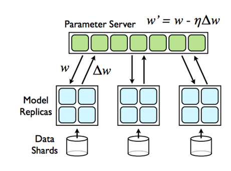

# 前言

之前帖子中提到的 data parallel 机制，每一个 batch 计算完毕后，都要进行模型参数同步，这无疑会拖慢整个训练的速度．而且因为木桶原理，整体的计算速度取决于最慢的那台．为了解决这个问题，一种异步的参数更新机制 ASGD 被提出. 本文的目的在于记录使用 Pytroch 实现 ASGD 过程中所遇到的一系列问题和解决方案．

# ASGD Overview

ASGD 主要参照的是[Google的文章](https://static.googleusercontent.com/media/research.google.com/en//archive/large_deep_networks_nips2012.pdf)，其流程如下图所示:

首先，模型分布的存储在多个计算节点（称作 worker）上，每个节点都有自己的 data shared，各节点的 data shared可重叠也可不重叠．除了这些计算节点之外，还有一个参数服务器（称作 master），存有一个共用的模型参数．每个计算节点在计算当前 batch 的数据之前，先去 master 上获取一套参数，然后在本地 forward&backward，最后将计算出的梯度传回 master，master 在接收到梯度后，便采用优化算法更新自己的参数．

这个做法绝妙的地方在于，各个 worker 是完全独立的，互不影响．就算计算过程中有某个 worker 挂了，训练流程还是可以照常运行．但因为有一个中心 master，这个系统不可避免的会存在瓶颈．

# ASGD 中的一些细节问题

- 可以预见，一旦 worker 的数量增多，势必会填满 master 的传输带宽，从而导致大部分 worker 都处于阻塞状态．所以 Google 在论文中也提出了使用`nfetch, npush`两个参数来控制 worker 取参数和传梯度的频率．但遗憾的是论文里只看到了`nfetch=npush=1`时的实验．当这两个参数设置的比较大时，可能对模型的收敛会有一定的影响．

- 关于 master 和 worker 优化算法的选择问题．首先，master 肯定会有自己的优化算法，而且当`nfetch`>1时，每个 worker 也需要有自己本地的优化算法．这样就会带来一个问题，master 和 worker 的优化算法不匹配．比如说我们使用带有 learning rate decay 的 SGD, 那么当 worker 的 lr 降低时，master 该如何处理呢？ Google 在论文中提出了，使用 Adagrad 算法结果会好很多，这估计是因为他们`nfetch`=1，而且 Adagrad 可以起到自动调节 lr 的作用．
